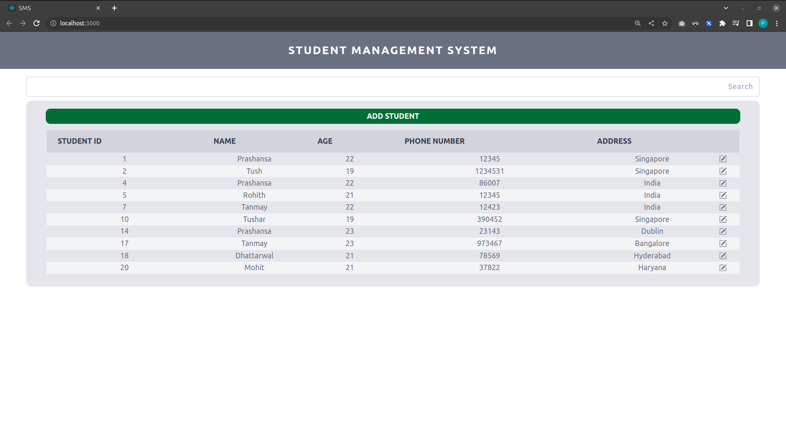
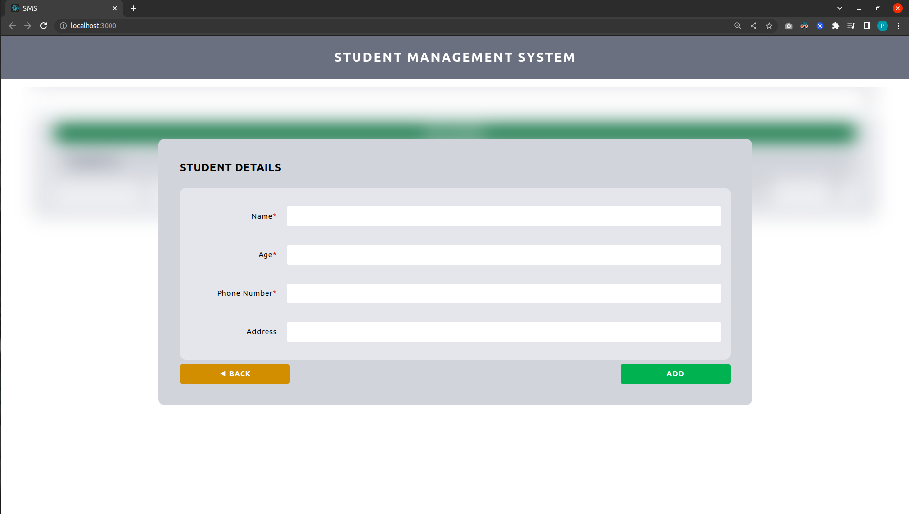
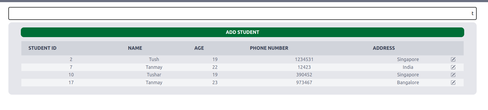
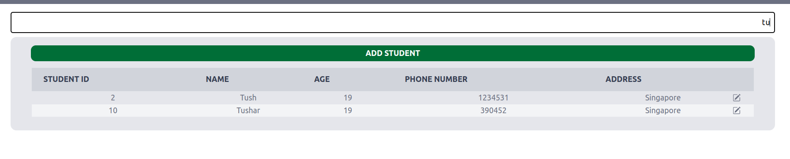
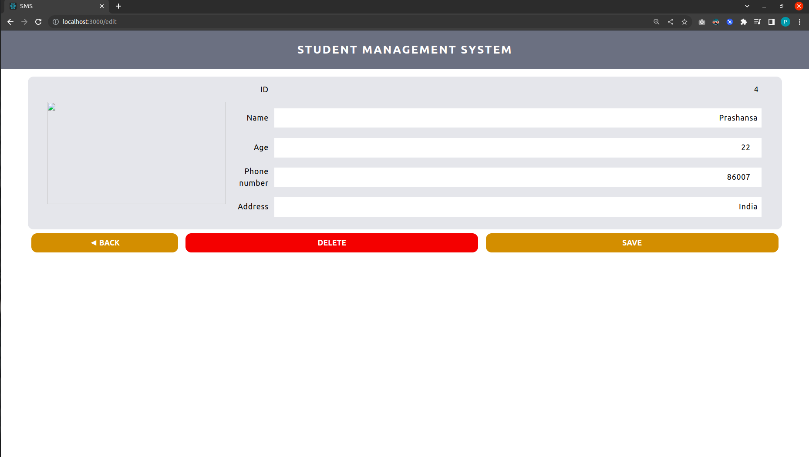
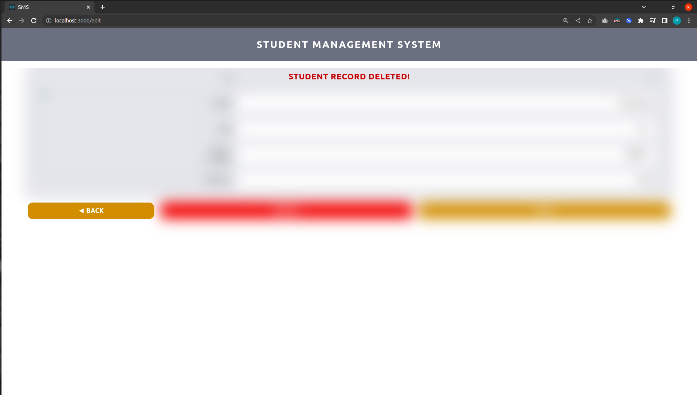

# Student Management System
*Student Management System* is a RESTful Web Service which makes use of Spring Boot, MySQL, and React JS.

## Backend
Java version used: 11  
It can be updated in pom.xml file of the Java project.

### Configuration of MySQL
Details coulld be found in *application.properties* file.

### Custom queries added 
The Data Access Layer makes use of the Spring Data JPARepository. This interface provides CRUD frunctionality for the entity class that is being managed.

- updateName:
  - updates the current name of the student
  - **Parameters:** id and updated name
  - **Query:** update students s set s.name = :newName where s.id = :id
- updateAge:
  - updates the current age of the student
  - **Parameters:** id and updated age
  - **Query:** update students s set s.age = :newAge where s.id = :id
- updatePhno:
  - updates the current phone number of the student
  - **Parameters:** id and updated phone number
  - **Query:** update students s set s.phone_number = :newPhno where s.id = :id
- updateAddr:
  - updates the current address of the student
  - **Parameters:** id and updated address
  - **Query:** update students s set s.address = :newAddr where s.id = :id
- findByPartialName:
  - finds all students with the name starting with the given prefix
  - **Parameters:** prefix *(pName)*
  - **Query:** select * from students s where s.name like :pName%

### APIs
To access the APIs, simply run the java application.
#### GET 
- Get all students: http://localhost:8000/students
- Get student by ID: http://localhost:8000/students/id 
  - here id is any valid student id
- Get student by name: http://localhost:8000/students/name/n 
  - here n is any valid student name
- Get student by given prefix: http://localhost:8000/students/pname/p 
  - here p is any valid student name prefix

#### POST 
- Add student: http://localhost:8000/students

#### PATCH 
- Update student details: http://localhost:8000/students/id
  - here id is the valid student id

#### DELETE 
- Delete student: http://localhost:8000/students/id
  - here id is the valid student id

## Frontend
The frontend for this application was developed using ReactJS and tailwind CSS.

### Running the React Application
Go to the Project folder, and run ***npm start***. The React application can be accessed using **port 3000** *(http://localhost:3000)*

***Note***: *Make sure the java application (backend) is running in the background.*

### Accessing the Application
The home page displays the list of all students. 

#### Home Page

#### Add Student

#### Search Student

#### Edit Student

#### Deleted Student Record
